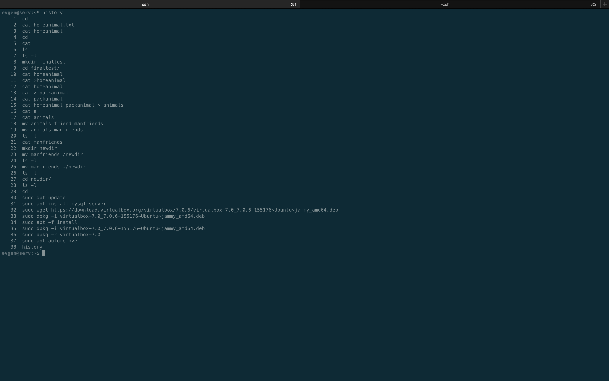

cat > homeanimals
cat
dog
hamster

cat > packanimals
horse
camel
donkey

cat homeanimal packanimal > animals
cat animals
mv animals manfriends

mv manfriends ./newdir

sudo apt update
sudo apt install mysql-server

sudo wget https://download.virtualbox.org/virtualbox/7.0.6/virtualbox-7.0_7.0.6-155176~Ubuntu~jammy_amd64.deb
sudo dpkg -i virtualbox-7.0_7.0.6-155176~Ubuntu~jammy_amd64.deb
sudo apt -f install
sudo dpkg -i virtualbox-7.0_7.0.6-155176~Ubuntu~jammy_amd64.deb
sudo dpkg -r virtualbox-7.0
sudo apt autoremove

history

